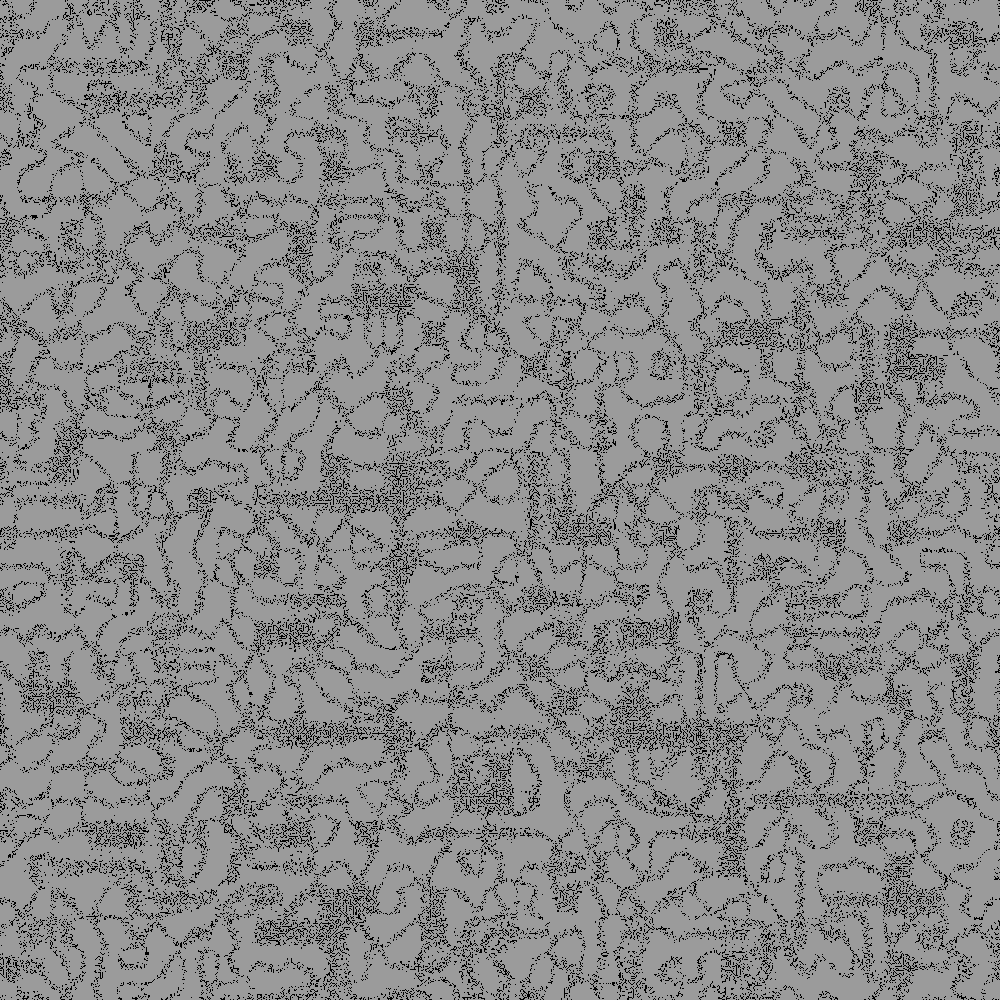

# A-Discord-Adventure

## Le projet

"A Discord Adventure" est un jeu vidéo de type RPG multijoueur. Il n'a pour le moment pas beaucoup de fonctionnalités,
car c'est long à développer. Actuellement, je travaille sur la version bêta, avec parfois l'aide d'une petite communauté
sur mon serveur discord.

   

Rejoindre le serveur discord pour suivre l'avancement : [Le serveur discord](https://discord.gg/gq3WuZ2uSR)

Toute aide sur ce github est la bienvenue. Merci à WolfoMir pour l'hébergement du projet qui tourne actuellement.

## Le bot

Pour le moment, il n'est possible de jouer au jeu qu'en utilisant le bot
discord. [Inviter le bot](https://discord.com/api/oauth2/authorize?client_id=854378559539511346&permissions=542058610129&scope=applications.commands%20bot).

L'intérêt d'utiliser un bot discord est le concept central du jeu : le voyage entre les serveurs discord. La plupart des
serveurs discord sont représentés par une ville dans le jeu. Une difficulté sera donc de pouvoir faire une histoire
évolutive.

Tout est généré de manière procédurale afin de pouvoir utiliser une grande carte. Actuellement les arbres sont générés
aléatoirement, mais une génération procédurale est prévue. De même pour les monstres, les coffres, et les bâtiments. Les
chemins et les rivières sont procéduraux à 100%. Ainsi, chaque joueur a
quasiment la même carte.

_Note : il n'est pas possible pour le moment de vérifier les serveurs vers lesquels le bot propose de voyager. Pensez à
faire attention aux serveurs que vous rejoignez ! Je mettrai en place dans le futur un système de signalement, mais
étant
donné la petite taille du bot ce n'est pas une priorité._

Le nom du bot est Lapinou second.

### Quelques exemples de map à l'heure actuelle

Si on prend une très grande carte, nous pouvons voir des patternes pour les chemins ...

Mais en ajoutant de la décoration, et avec une carte plus petite, le rendu est bien meilleur.

Ceci était un des premiers rendus. Depuis, j'ai ajouté de nombreux éléments. Voici quelques exemples :

  

Et bien sûr, je ne montre pas tout !!

# Le jeu

**Je vous invite à TERMINER le tutoriel afin de comprendre le jeu et de lire les dialogues. La plupart des gens ne le
font pas.**

L'histoire n'est pas encore complète, mais le but final du jeu sera de trouver le **Wumpus d'or**.

Récolter des ressources, vendre, trouver des items, se battre, ...

# Le repo github

Comme vous pouvez le constater, le bot discord est open source sous license MIT. Vous pouvez donc librement le
réutiliser et vous en inspirer. Malgré tout, si vous réutilisez le code du bot, citer le projet et le code d'origine est
apprécié.

## Star History

